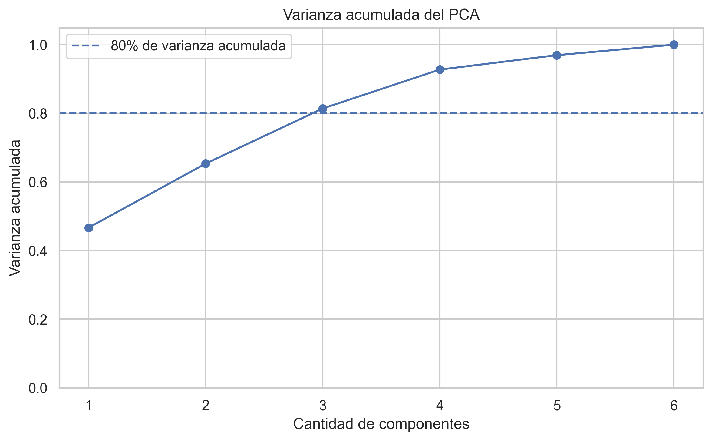
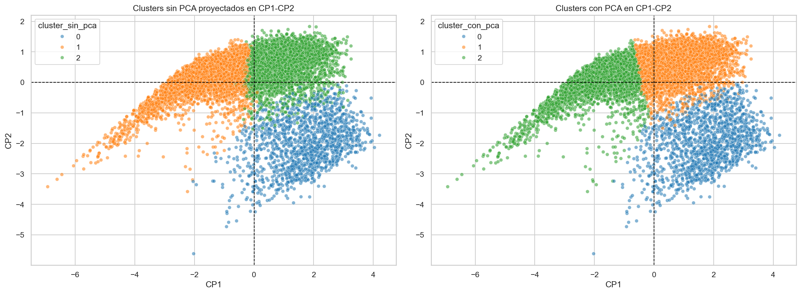

# Formula 1 Performance Clustering
**Autores:** Juan Ignacio Castillo, Santino Almirón Nanni, Santino Malatini

---

Este proyecto desarrolla un análisis multivariado sobre resultados históricos de Fórmula 1, con el objetivo de identificar perfiles de desempeño en observaciones piloto-carrera. El trabajo incluye análisis exploratorio de datos, construcción de variables derivadas, Análisis de Componentes Principales (PCA) y clustering mediante K-Means.

La unidad de análisis no es una carrera completa, sino una observación piloto-carrera. Es decir, cada fila representa el desempeño de un piloto específico en una carrera determinada.

---

## Objetivo

El objetivo principal del proyecto es segmentar observaciones de Fórmula 1 en grupos interpretables según variables relacionadas con el rendimiento deportivo, la continuidad en carrera y el desempeño posicional.

A partir de PCA y clustering se busca identificar perfiles como:

- carreras problemáticas o abandonos;
- pilotos que completan la carrera con rendimiento medio-bajo;
- observaciones de alto rendimiento competitivo.

---

## Dataset y unidad de análisis

El dataset utilizado contiene información de resultados de Fórmula 1 a nivel piloto-carrera. Cada fila representa la participación de un piloto en una carrera determinada, por lo que una misma carrera puede aparecer varias veces: una por cada piloto participante.

A partir de las variables originales se construyó una base procesada para el análisis. Algunas variables relevantes utilizadas fueron originales del dataset, mientras que otras fueron derivadas durante el preprocesamiento para facilitar la interpretación.

### Variables originales relevantes

- `grid`: posición de largada del piloto.
- `positionOrder`: posición final del piloto en la carrera.
- `laps`: cantidad de vueltas completadas.
- `driver_championship_position`: posición del piloto en el campeonato.
- `driver_championship_wins`: victorias acumuladas del piloto en el campeonato.
- `constructor_name`: escudería.
- `driver_name`: piloto.

### Variables derivadas

- `laps_pct`: proporción de carrera completada. Se calculó como las vueltas completadas por el piloto divididas por el máximo de vueltas completadas en esa carrera.
- `driver_age`: edad del piloto al momento de la carrera.
- `decada`: década de realización de la carrera.
- `resultado_grupo`: agrupación del resultado final en categorías como ganador, podio, top 10 o fuera del top 10.
- `largada_grupo`: agrupación de la posición de largada en categorías como pole, top 5, top 10 o fondo.
- `status_grupo`: agrupación del estado final de la carrera en categorías como clasificado/terminó, abandono mecánico, incidente/abandono u otro.
- `posiciones_ganadas`: diferencia entre la posición de largada y la posición final.

---

## Estructura del repositorio

```text
.
├── data/
│   ├── raw/
│   └── processed/
├── notebooks/
│   ├── eda/
│   │   └── EDA_corregido.ipynb
│   ├── pca/
│   │   └── PCA_formula1.ipynb
│   └── clustering/
│       └── Cluster_formula1.ipynb
├── reports/
│   └── figures/
├── docs/
│   └── assets/
├── requirements.txt
└── README.md

```

---

## Metodología

### 1. Análisis exploratorio de datos

En primer lugar se realizó un análisis exploratorio sobre la base procesada, con el objetivo de conocer la estructura general del dataset, revisar valores faltantes, analizar distribuciones de variables numéricas y categóricas, y estudiar relaciones bivariadas relevantes.

El EDA permitió comprender la unidad de análisis piloto-carrera y detectar variables importantes para las etapas posteriores, como la posición de largada, la posición final, la proporción de carrera completada y las categorías de resultado, largada y estado final.

### 2. Preparación de variables

Para el PCA y el clustering se seleccionaron variables numéricas relacionadas con el desempeño piloto-carrera.

Se excluyeron variables como `race_points` y `driver_championship_points`, ya que el sistema de puntuación de Fórmula 1 cambió a lo largo del tiempo y los puntos brutos no son directamente comparables entre décadas.

También se reemplazó `laps` por `laps_pct`, ya que las carreras no tienen todas la misma cantidad de vueltas. De esta forma, laps_pct mide la proporción de carrera completada por cada piloto respecto del máximo de vueltas de esa carrera.

### 3. Análisis de Componentes Principales

Se aplicó PCA sobre variables estandarizadas con el objetivo de reducir la dimensionalidad y evitar redundancias entre variables correlacionadas.

Las tres primeras componentes principales explicaron aproximadamente el 81,4% de la variabilidad total.



Las componentes se interpretaron de la siguiente manera:

- **CP1**: desempeño posicional general. Valores positivos se asocian con peores posiciones de largada, llegada y campeonato, mientras que valores negativos se vinculan con mejores posiciones y mayor rendimiento competitivo.
- **CP2**: continuidad en carrera o proporción de carrera completada, dominada principalmente por `laps_pct`.
- **CP3**: perfil etario del piloto, explicado principalmente por `driver_age`.

### 4. Clustering

Se compararon dos enfoques:

1. clustering sobre variables originales escaladas;
2. clustering sobre la matriz de componentes principales.

El clustering sin PCA se utilizó como análisis exploratorio. Para la interpretación final se priorizó el clustering con PCA, ya que produjo grupos más limpios e interpretables.

Se utilizó K-Means y se evaluó la cantidad de clusters mediante el método del codo, silhouette score y Gap Statistic. La solución final elegida fue K = 3.



---

## Resultados principales

La solución final permitió identificar tres perfiles principales:

### Cluster 0: carreras problemáticas o abandonos

Este grupo reúne observaciones con baja proporción de carrera completada, malos resultados finales y mayor presencia de abandonos mecánicos o incidentes.

### Cluster 1: finalizadores de rendimiento medio-bajo

Este grupo contiene pilotos que suelen completar la carrera, pero mayormente fuera de las posiciones principales. Presentan `laps_pct` alto, aunque con resultados generalmente fuera del top 10.

### Cluster 2: alto rendimiento competitivo

Este grupo representa observaciones de mejor desempeño deportivo. Se caracteriza por mejores posiciones de largada y llegada, mejor ubicación en el campeonato y mayor presencia de top 10, podios y victorias.

---

## Variables suplementarias

Además de las variables utilizadas para formar los clusters, se analizaron escuderías y pilotos como variables suplementarias. Estas variables no participaron directamente en el clustering, pero permiten interpretar si determinados equipos o corredores aparecen con mayor frecuencia en alguno de los perfiles.

El análisis mostró que escuderías históricamente fuertes como Mercedes, Ferrari, Red Bull y McLaren aparecen con mayor proporción en el cluster de alto rendimiento.

---

## Conclusiones

El análisis permitió transformar datos históricos de Fórmula 1 en perfiles interpretables de desempeño piloto-carrera. La combinación de PCA y K-Means permitió reducir la dimensionalidad, evitar redundancias entre variables y obtener una segmentación clara en tres grupos principales: carreras problemáticas, finalizadores de rendimiento medio-bajo y observaciones de alto rendimiento competitivo.

El uso de variables suplementarias como escuderías y pilotos ayudó a validar la interpretación de los clusters, mostrando patrones coherentes con el historial competitivo de la Fórmula 1.